# 🏛️ MuseumBot: Step-by-Step Project Explanation

## 🎯 What This Project Does

MuseumBot is an **AI-powered museum assistant** that combines the intelligence of a chatbot with practical ticket booking functionality. Think of it as a smart museum concierge that can:

1. **Answer questions** about artworks, artists, and museum information
2. **Book tickets** through natural conversation (with full visitor details)
3. **Help navigate** the museum by finding specific artworks
4. **Manage bookings** (view, cancel, track history with status lifecycle)

## 🚀 How It Works: Step-by-Step Flow

### **Step 1: User Arrives at the Website**
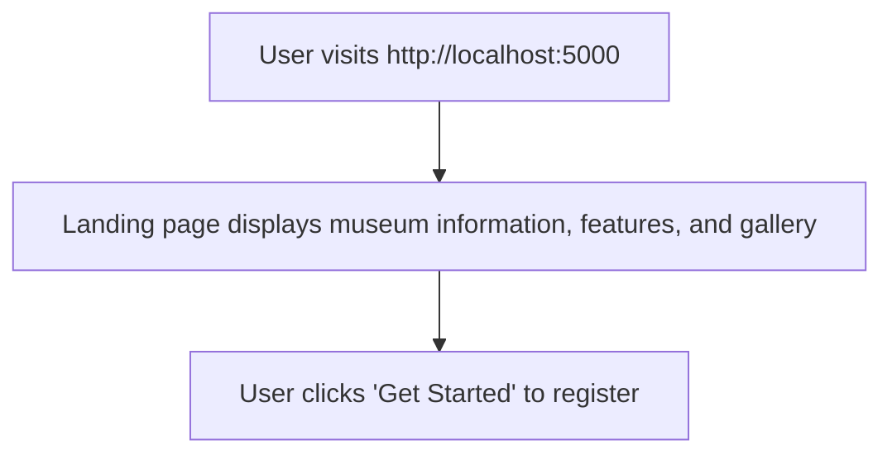
```mermaid
graph TD
    A["User&nbsp;visits&nbsp;http://localhost:5000"] --> B["Landing&nbsp;page&nbsp;displays&nbsp;museum&nbsp;information,&nbsp;features,&nbsp;and&nbsp;gallery"]
    B --> C["User&nbsp;clicks&nbsp;'Get&nbsp;Started'&nbsp;to&nbsp;register"]
```

**What happens behind the scenes:**
- Flask serves the `landing.html` template (extends `base.html`)
- Custom CSS with CSS Grid, Flexbox, and CSS variables provides responsive styling
- AOS (Animate On Scroll) library triggers smooth scroll animations
- Google Fonts (Poppins + Playfair Display) provide typography
- Font Awesome icons enhance the UI

### **Step 2: User Registration**
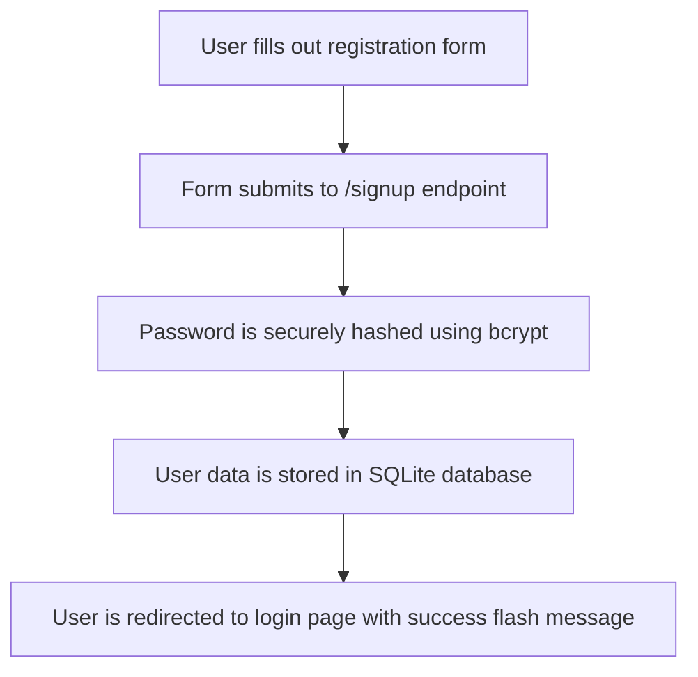
```mermaid
graph TD
    A["User&nbsp;fills&nbsp;out&nbsp;registration&nbsp;form"] --> B["Form&nbsp;submits&nbsp;to&nbsp;/signup&nbsp;endpoint"]
    B --> C["Password&nbsp;is&nbsp;securely&nbsp;hashed&nbsp;using&nbsp;bcrypt"]
    C --> D["User&nbsp;data&nbsp;is&nbsp;stored&nbsp;in&nbsp;SQLite&nbsp;database"]
    D --> E["User&nbsp;is&nbsp;redirected&nbsp;to&nbsp;login&nbsp;page&nbsp;with&nbsp;success&nbsp;flash&nbsp;message"]
```

**Technical details:**
```python
# Password security
hashed_password = bcrypt.hashpw(password.encode('utf-8'), bcrypt.gensalt())

# Database insertion with parameterized queries (prevents SQL injection)
conn.execute(
    "INSERT INTO users (username, email, password, created_at) VALUES (?, ?, ?, ?)",
    (username, email, hashed_password, datetime.utcnow().isoformat())
)
```

### **Step 3: User Login**
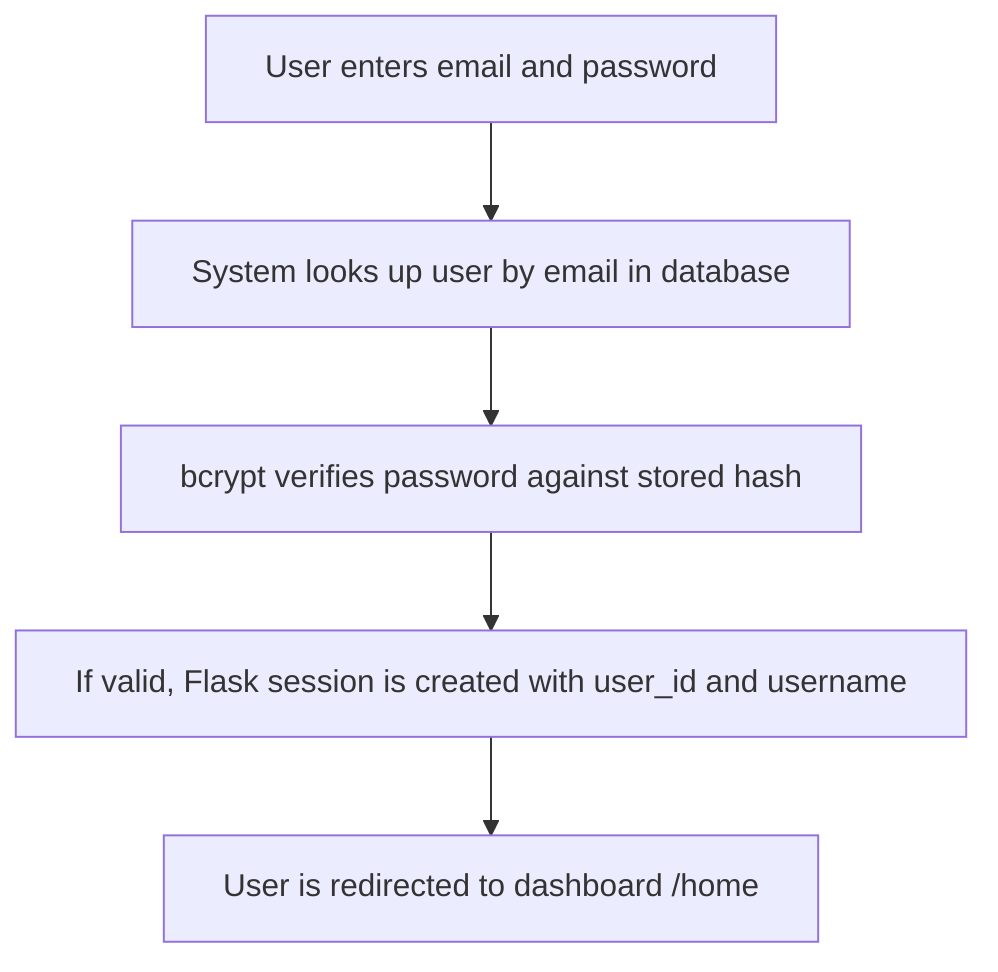
```mermaid
graph TD
    A["User&nbsp;enters&nbsp;email&nbsp;and&nbsp;password"] --> B["System&nbsp;looks&nbsp;up&nbsp;user&nbsp;by&nbsp;email&nbsp;in&nbsp;database"]
    B --> C["bcrypt&nbsp;verifies&nbsp;password&nbsp;against&nbsp;stored&nbsp;hash"]
    C --> D["If&nbsp;valid,&nbsp;Flask&nbsp;session&nbsp;is&nbsp;created&nbsp;with&nbsp;user_id&nbsp;and&nbsp;username"]
    D --> E["User&nbsp;is&nbsp;redirected&nbsp;to&nbsp;dashboard&nbsp;/home"]
```

**Security features:**
- Passwords are never stored in plain text
- Sessions use random secret keys (`os.urandom(24)`)
- Failed login attempts show flash error messages

### **Step 4: Dashboard Access**
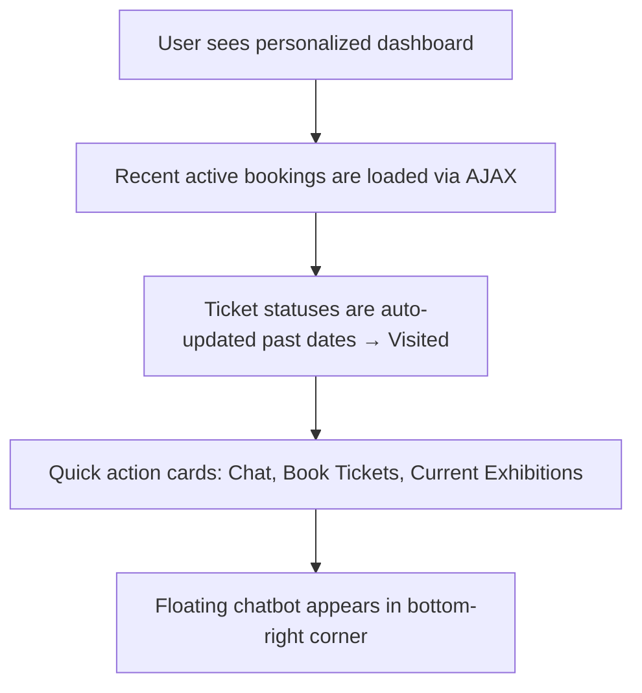
```mermaid
graph TD
    A["User&nbsp;sees&nbsp;personalized&nbsp;dashboard"] --> B["Recent&nbsp;active&nbsp;bookings&nbsp;are&nbsp;loaded&nbsp;via&nbsp;AJAX"]
    B --> C["Ticket&nbsp;statuses&nbsp;are&nbsp;auto-updated&nbsp;past&nbsp;dates&nbsp;→&nbsp;Visited"]
    C --> D["Quick&nbsp;action&nbsp;cards:&nbsp;Chat,&nbsp;Book&nbsp;Tickets,&nbsp;Current&nbsp;Exhibitions"]
    D --> E["Floating&nbsp;chatbot&nbsp;appears&nbsp;in&nbsp;bottom-right&nbsp;corner"]
```

**Dashboard features:**
- User-specific booking history (filtered by `user_id`)
- Real-time ticket booking form modal (with visitor details)
- Ticket history modal (shows Active, Cancelled, Visited statuses)
- Booking details modal (full visitor info)
- Exhibitions modal (current exhibitions display)
- Interactive floating chatbot with chat persistence

### **Step 5: Chatbot Interaction**
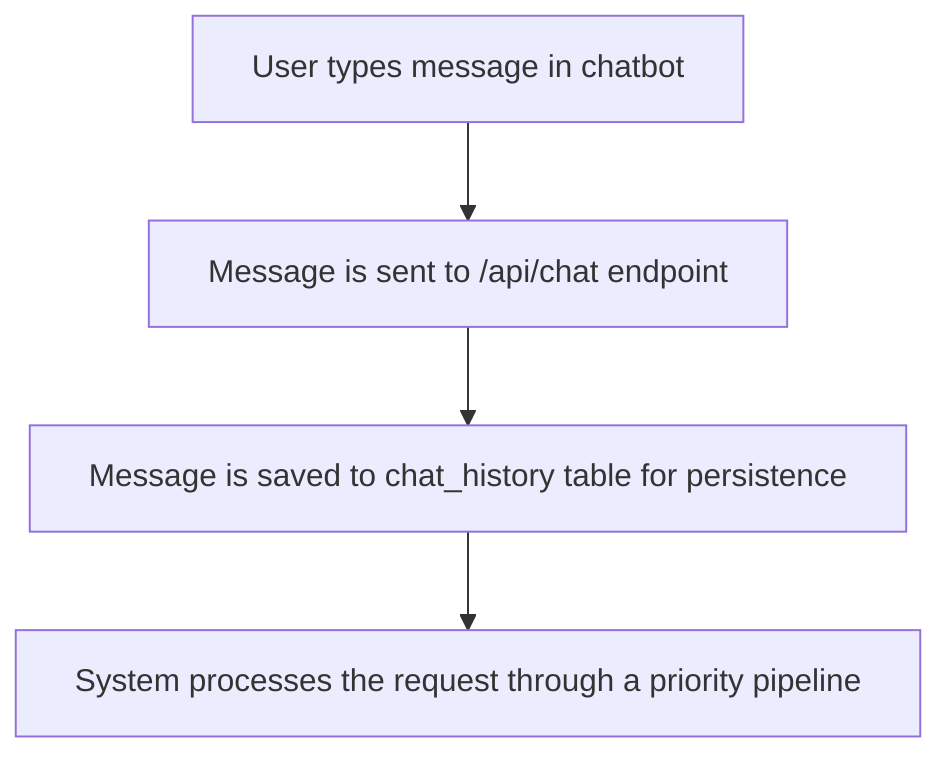
```mermaid
graph TD
    A["User&nbsp;types&nbsp;message&nbsp;in&nbsp;chatbot"] --> B["Message&nbsp;is&nbsp;sent&nbsp;to&nbsp;/api/chat&nbsp;endpoint"]
    B --> C["Message&nbsp;is&nbsp;saved&nbsp;to&nbsp;chat_history&nbsp;table&nbsp;for&nbsp;persistence"]
    C --> D["System&nbsp;processes&nbsp;the&nbsp;request&nbsp;through&nbsp;a&nbsp;priority&nbsp;pipeline"]
```

**Message processing pipeline (in order):**
1. **Q&A Lookup**: Normalize question, check against Excel Q&A database (`qa_dict`)
2. **Cancel Detection**: Check for cancel/delete keywords + extract booking ID via regex
3. **Booking Detection**: Check for book/ticket keywords + extract visitor details via regex
4. **AI Processing**: If none of above match, send to Ollama AI agent with MCP tools

### **Step 6: Ticket Booking Process (via Chat)**
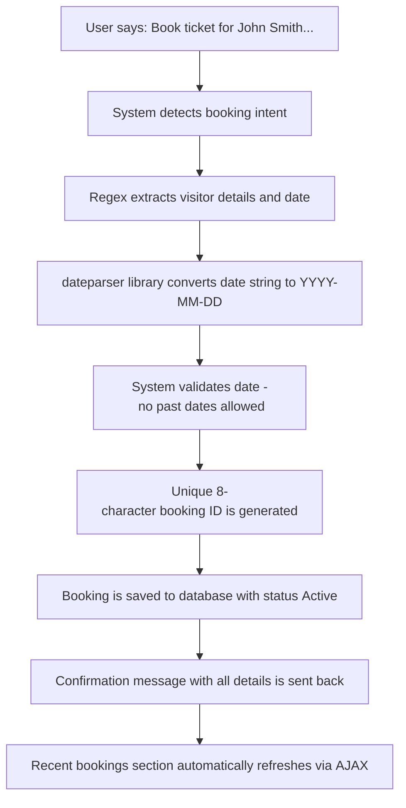
```mermaid
graph TD
    A["User&nbsp;says:&nbsp;Book&nbsp;ticket&nbsp;for&nbsp;John&nbsp;Smith..."] --> B["System&nbsp;detects&nbsp;booking&nbsp;intent"]
    B --> C["Regex&nbsp;extracts&nbsp;visitor&nbsp;details&nbsp;and&nbsp;date"]
    C --> D["dateparser&nbsp;library&nbsp;converts&nbsp;date&nbsp;string&nbsp;to&nbsp;YYYY-MM-DD"]
    D --> E["System&nbsp;validates&nbsp;date&nbsp;-&nbsp;no&nbsp;past&nbsp;dates&nbsp;allowed"]
    E --> F["Unique&nbsp;8-character&nbsp;booking&nbsp;ID&nbsp;is&nbsp;generated"]
    F --> G["Booking&nbsp;is&nbsp;saved&nbsp;to&nbsp;database&nbsp;with&nbsp;status&nbsp;Active"]
    G --> H["Confirmation&nbsp;message&nbsp;with&nbsp;all&nbsp;details&nbsp;is&nbsp;sent&nbsp;back"]
    H --> I["Recent&nbsp;bookings&nbsp;section&nbsp;automatically&nbsp;refreshes&nbsp;via&nbsp;AJAX"]
```

**Regex extraction (from `app.py`):**
```python
name_match = re.search(r'for\s+([A-Za-z\s]+),\s*age', query, re.IGNORECASE)
age_match = re.search(r'age\s+(\d+)', query, re.IGNORECASE)
gender_match = re.search(r'(male|female|other)', query, re.IGNORECASE)
contact_match = re.search(r'contact\s+(\d{10})', query, re.IGNORECASE)
ticket_match = re.search(r'(\d+)\s*tickets?', query.lower())
date_match = re.search(r'(\d+)\s*tickets?\s+for\s+([a-zA-Z0-9\s\-/,]+)$', query, re.IGNORECASE)
```

### **Step 7: Ticket Booking (via Web Form)**
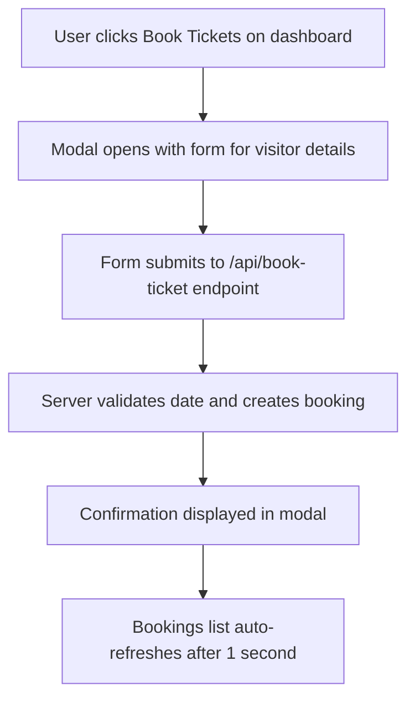
```mermaid
graph TD
    A["User&nbsp;clicks&nbsp;Book&nbsp;Tickets&nbsp;on&nbsp;dashboard"] --> B["Modal&nbsp;opens&nbsp;with&nbsp;form&nbsp;for&nbsp;visitor&nbsp;details"]
    B --> C["Form&nbsp;submits&nbsp;to&nbsp;/api/book-ticket&nbsp;endpoint"]
    C --> D["Server&nbsp;validates&nbsp;date&nbsp;and&nbsp;creates&nbsp;booking"]
    D --> E["Confirmation&nbsp;displayed&nbsp;in&nbsp;modal"]
    E --> F["Bookings&nbsp;list&nbsp;auto-refreshes&nbsp;after&nbsp;1&nbsp;second"]
```

### **Step 8: AI-Powered Responses**
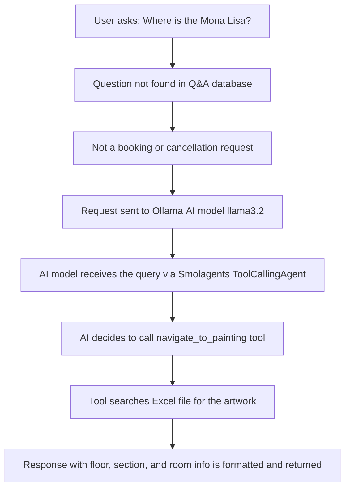
```mermaid
graph TD
    A["User&nbsp;asks:&nbsp;Where&nbsp;is&nbsp;the&nbsp;Mona&nbsp;Lisa?"] --> B["Question&nbsp;not&nbsp;found&nbsp;in&nbsp;Q&A&nbsp;database"]
    B --> C["Not&nbsp;a&nbsp;booking&nbsp;or&nbsp;cancellation&nbsp;request"]
    C --> D["Request&nbsp;sent&nbsp;to&nbsp;Ollama&nbsp;AI&nbsp;model&nbsp;llama3.2"]
    D --> E["AI&nbsp;model&nbsp;receives&nbsp;the&nbsp;query&nbsp;via&nbsp;Smolagents&nbsp;ToolCallingAgent"]
    E --> F["AI&nbsp;decides&nbsp;to&nbsp;call&nbsp;navigate_to_painting&nbsp;tool"]
    F --> G["Tool&nbsp;searches&nbsp;Excel&nbsp;file&nbsp;for&nbsp;the&nbsp;artwork"]
    G --> H["Response&nbsp;with&nbsp;floor,&nbsp;section,&nbsp;and&nbsp;room&nbsp;info&nbsp;is&nbsp;formatted&nbsp;and&nbsp;returned"]
```

**AI integration details:**
- Uses local Ollama server for complete privacy (no data sent externally)
- MCP (Model Context Protocol) for structured tool communication via FastMCP
- `llama3.2:latest` model used in production (`app.py`)
- 6 MCP tools available: check availability, navigate, description, painter info, image, complete info
- Smolagents `ToolCallingAgent` handles tool selection and execution

### **Step 9: Artwork Navigation**
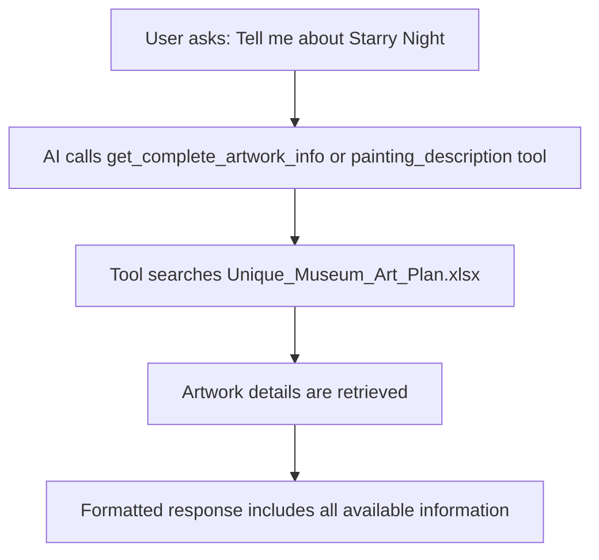
```mermaid
graph TD
    A["User&nbsp;asks:&nbsp;Tell&nbsp;me&nbsp;about&nbsp;Starry&nbsp;Night"] --> B["AI&nbsp;calls&nbsp;get_complete_artwork_info&nbsp;or&nbsp;painting_description&nbsp;tool"]
    B --> C["Tool&nbsp;searches&nbsp;Unique_Museum_Art_Plan.xlsx"]
    C --> D["Artwork&nbsp;details&nbsp;are&nbsp;retrieved"]
    D --> E["Formatted&nbsp;response&nbsp;includes&nbsp;all&nbsp;available&nbsp;information"]
```

**Data sources:**
- `Chatbot Question and answers.xlsx`: Pre-defined Q&A pairs (loaded at startup into `qa_dict`)
- `Unique_Museum_Art_Plan.xlsx`: Artwork information including names, rooms, descriptions, history, artist info

### **Step 10: Booking Cancellation**
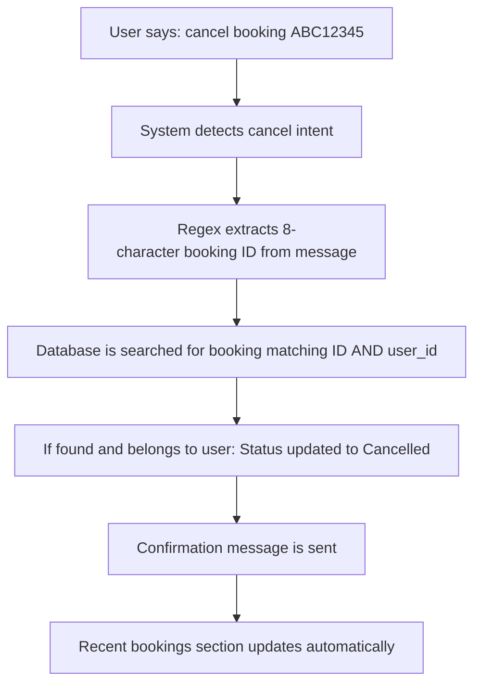
```mermaid
graph TD
    A["User&nbsp;says:&nbsp;cancel&nbsp;booking&nbsp;ABC12345"] --> B["System&nbsp;detects&nbsp;cancel&nbsp;intent"]
    B --> C["Regex&nbsp;extracts&nbsp;8-character&nbsp;booking&nbsp;ID&nbsp;from&nbsp;message"]
    C --> D["Database&nbsp;is&nbsp;searched&nbsp;for&nbsp;booking&nbsp;matching&nbsp;ID&nbsp;AND&nbsp;user_id"]
    D --> E["If&nbsp;found&nbsp;and&nbsp;belongs&nbsp;to&nbsp;user:&nbsp;Status&nbsp;updated&nbsp;to&nbsp;Cancelled"]
    E --> F["Confirmation&nbsp;message&nbsp;is&nbsp;sent"]
    F --> G["Recent&nbsp;bookings&nbsp;section&nbsp;updates&nbsp;automatically"]
```

**Security features:**
- Users can only cancel their own bookings (verified via `user_id`)
- Bookings are **soft deleted** — status changes to "Cancelled", record is preserved
- Database transactions ensure data integrity

### **Step 11: Chat Persistence**
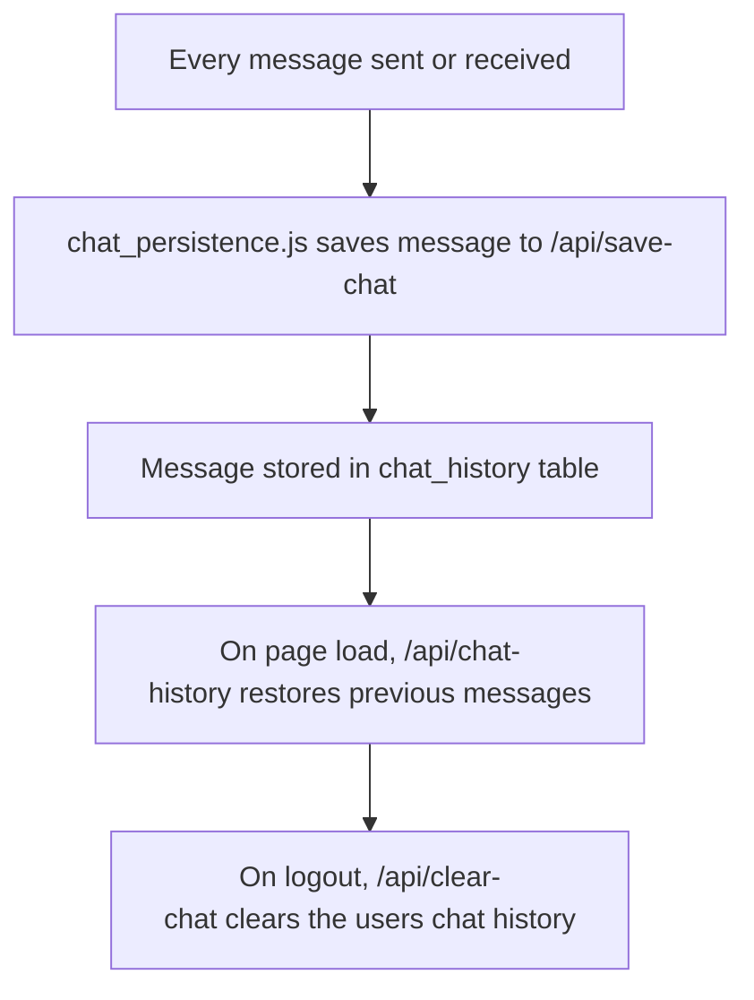
```mermaid
graph TD
    A["Every&nbsp;message&nbsp;sent&nbsp;or&nbsp;received"] --> B["chat_persistence.js&nbsp;saves&nbsp;message&nbsp;to&nbsp;/api/save-chat"]
    B --> C["Message&nbsp;stored&nbsp;in&nbsp;chat_history&nbsp;table"]
    C --> D["On&nbsp;page&nbsp;load,&nbsp;/api/chat-history&nbsp;restores&nbsp;previous&nbsp;messages"]
    D --> E["On&nbsp;logout,&nbsp;/api/clear-chat&nbsp;clears&nbsp;the&nbsp;users&nbsp;chat&nbsp;history"]
```

### **Step 12: Real-time Updates**
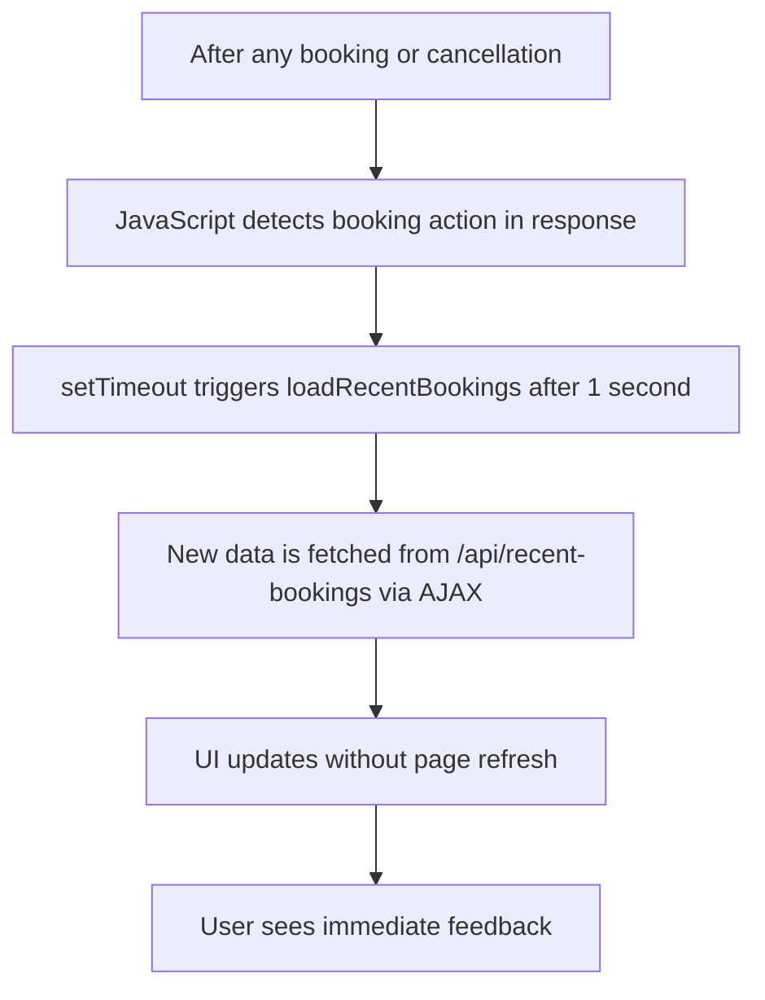
```mermaid
graph TD
    A["After&nbsp;any&nbsp;booking&nbsp;or&nbsp;cancellation"] --> B["JavaScript&nbsp;detects&nbsp;booking&nbsp;action&nbsp;in&nbsp;response"]
    B --> C["setTimeout&nbsp;triggers&nbsp;loadRecentBookings&nbsp;after&nbsp;1&nbsp;second"]
    C --> D["New&nbsp;data&nbsp;is&nbsp;fetched&nbsp;from&nbsp;/api/recent-bookings&nbsp;via&nbsp;AJAX"]
    D --> E["UI&nbsp;updates&nbsp;without&nbsp;page&nbsp;refresh"]
    E --> F["User&nbsp;sees&nbsp;immediate&nbsp;feedback"]
```

**Frontend updates:**
- AJAX calls (fetch API) for seamless experience
- Automatic refresh after booking/cancellation actions
- Loading states with CSS spinner animations
- Responsive card grid updates dynamically

## 🔧 Technical Architecture Breakdown

### **Backend Components**

1. **Flask Application (`app.py`)**
   - Web server and route handler (13 routes)
   - User authentication and sessions
   - Database operations (3 tables)
   - Natural language date parsing (dateparser + manual fallback)
   - Chat history persistence
   - Booking CRUD with status lifecycle

2. **MCP Server (`server.py`)**
   - FastMCP server with 6 artwork tools
   - Excel data loading and searching
   - Stdio transport for communication with Smolagents

3. **AI Agent (`agent.py`)**
   - Standalone Ollama model configuration
   - MCP tool integration setup
   - Used for development/testing

4. **Database Migration (`migrate_db.py`)**
   - Schema evolution script
   - Adds new columns to bookings table
   - Creates chat_history table
   - Maps existing data to new schema

### **Frontend Components**

1. **HTML Templates (Jinja2)**
   - `base.html`: Common layout with navbar, floating chatbot, AOS init
   - `landing.html`: Marketing homepage with hero, features, gallery, about sections
   - `login.html` & `signup.html`: Auth forms with gradient backgrounds
   - `home.html`: Dashboard with quick actions, bookings, 4 modals

2. **JavaScript Functions**
   - `chat_persistence.js`: Chat save/load/clear with database backend
   - Chatbot message handling with loading states
   - Form submissions with AJAX
   - Real-time booking list updates
   - Modal management (open/close/outside-click)

3. **Styling**
   - Custom CSS (no framework) with CSS variables for theming
   - CSS Grid for responsive card layouts
   - Glassmorphism effects (backdrop-filter)
   - Gradient backgrounds and hover animations
   - Mobile-responsive with `@media (max-width: 768px)` breakpoint

### **Data Storage**

1. **SQLite Database (`app.db`)**
   - `users` table: authentication data (id, username, email, bcrypt password)
   - `bookings` table: ticket reservations with visitor details and status lifecycle
   - `chat_history` table: persistent chat messages per user

2. **Excel Files**
   - Q&A database: pre-defined question-answer pairs
   - Art database: artwork names, rooms, floors, sections, descriptions, history, artist info

## 🎨 User Experience Flow

### **First-Time User Journey**
1. **Discovery**: Lands on attractive landing page with hero, features, gallery
2. **Registration**: Simple 3-field signup (username, email, password)
3. **Login**: Quick authentication with flash messages
4. **Dashboard**: Personalized welcome with quick action cards
5. **Chat**: Floating chatbot with natural conversation
6. **Booking**: Book via chat or web form with full visitor details
7. **Confirmation**: Clear booking details with unique ID

### **Returning User Journey**
1. **Login**: Quick authentication
2. **Dashboard**: View active bookings with auto-updated statuses
3. **Chat History**: Previous chat messages restored automatically
4. **Management**: Cancel bookings, view details, check history
5. **Support**: Get help through AI chatbot

## 🔄 Data Flow Examples

### **Booking Flow**
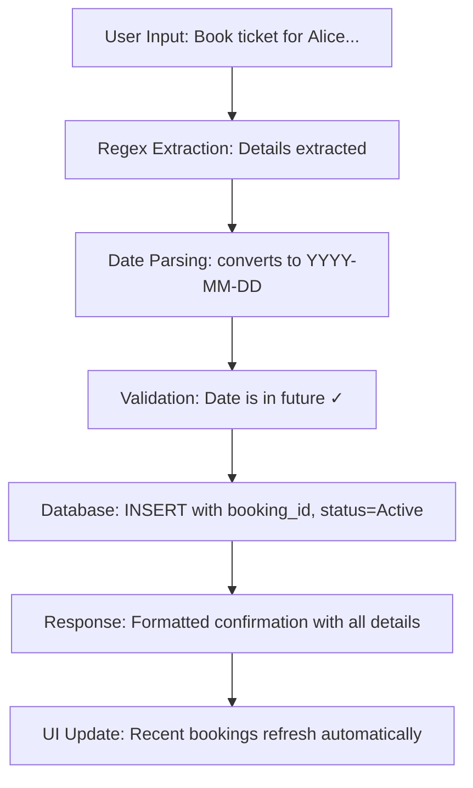
```mermaid
graph TD
    A["User&nbsp;Input:&nbsp;Book&nbsp;ticket&nbsp;for&nbsp;Alice..."] --> B["Regex&nbsp;Extraction:&nbsp;Details&nbsp;extracted"]
    B --> C["Date&nbsp;Parsing:&nbsp;converts&nbsp;to&nbsp;YYYY-MM-DD"]
    C --> D["Validation:&nbsp;Date&nbsp;is&nbsp;in&nbsp;future&nbsp;✓"]
    D --> E["Database:&nbsp;INSERT&nbsp;with&nbsp;booking_id,&nbsp;status=Active"]
    E --> F["Response:&nbsp;Formatted&nbsp;confirmation&nbsp;with&nbsp;all&nbsp;details"]
    F --> G["UI&nbsp;Update:&nbsp;Recent&nbsp;bookings&nbsp;refresh&nbsp;automatically"]
```

### **Question Flow (Q&A Match)**
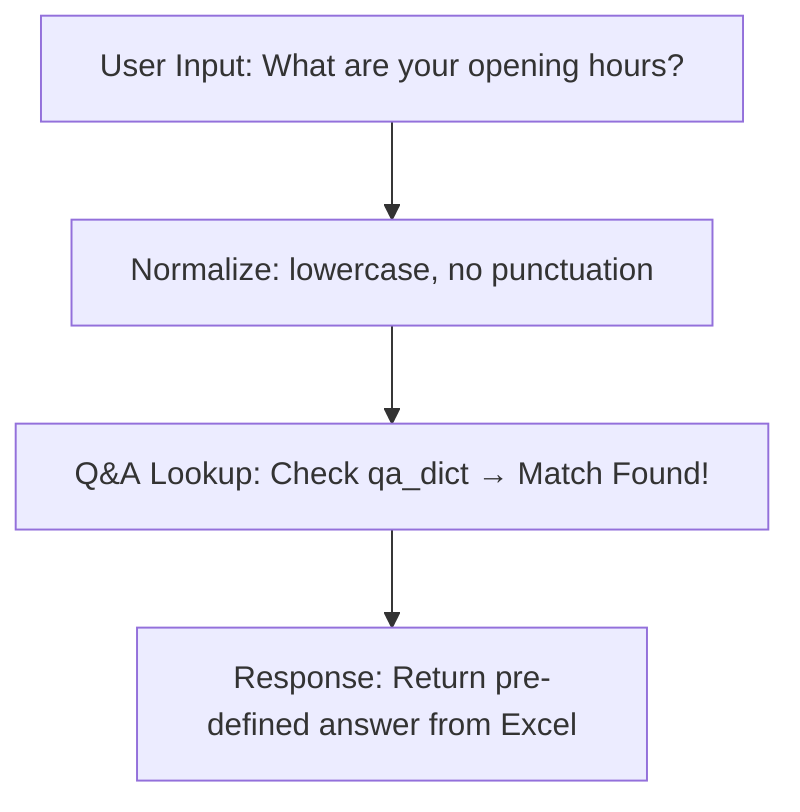
```mermaid
graph TD
    A["User&nbsp;Input:&nbsp;What&nbsp;are&nbsp;your&nbsp;opening&nbsp;hours?"] --> B["Normalize:&nbsp;lowercase,&nbsp;no&nbsp;punctuation"]
    B --> C["Q&A&nbsp;Lookup:&nbsp;Check&nbsp;qa_dict&nbsp;→&nbsp;Match&nbsp;Found!"]
    C --> D["Response:&nbsp;Return&nbsp;pre-defined&nbsp;answer&nbsp;from&nbsp;Excel"]
```

### **Question Flow (AI Fallback)**
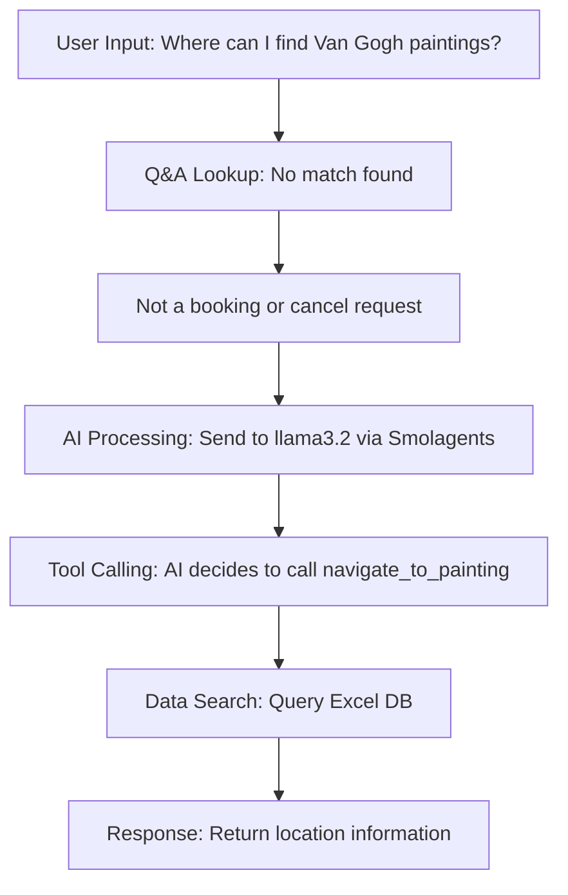
```mermaid
graph TD
    A["User&nbsp;Input:&nbsp;Where&nbsp;can&nbsp;I&nbsp;find&nbsp;Van&nbsp;Gogh&nbsp;paintings?"] --> B["Q&A&nbsp;Lookup:&nbsp;No&nbsp;match&nbsp;found"]
    B --> C["Not&nbsp;a&nbsp;booking&nbsp;or&nbsp;cancel&nbsp;request"]
    C --> D["AI&nbsp;Processing:&nbsp;Send&nbsp;to&nbsp;llama3.2&nbsp;via&nbsp;Smolagents"]
    D --> E["Tool&nbsp;Calling:&nbsp;AI&nbsp;decides&nbsp;to&nbsp;call&nbsp;navigate_to_painting"]
    E --> F["Data&nbsp;Search:&nbsp;Query&nbsp;Excel&nbsp;DB"]
    F --> G["Response:&nbsp;Return&nbsp;location&nbsp;information"]
```

## 🛡️ Security & Reliability

### **Data Protection**
- Passwords hashed with bcrypt (random salt per password)
- SQL injection prevention with parameterized queries throughout
- Session security with `os.urandom(24)` secret keys
- Booking ownership verification via `user_id`

### **Error Handling**
- Try/catch blocks on all database operations
- Graceful degradation when AI is unavailable
- Input validation on all user inputs (dates, contacts, etc.)
- User-friendly error messages with emoji indicators
- Debug logging with `[Q&A DEBUG]`, `[BOOKING]`, `[AGENT]`, `[ERROR]` prefixes

### **Performance Optimization**
- Q&A data loaded once at startup (O(1) dictionary lookup)
- Art data loaded once at startup in MCP server
- Lightweight AI model for fast local responses
- AJAX updates avoid full page reloads
- CSS animations for perceived performance

## 🎯 Key Features Explained

### **Natural Language Date Parsing**
- Primary: `dateparser` library for advanced parsing (relative dates, multiple formats)
- Fallback: Manual pattern matching for common cases (tomorrow, next week, etc.)
- Prevents booking for past dates
- User-friendly error messages for unrecognized dates

### **Smart Booking System**
- Unique 8-character alphanumeric booking IDs
- Full visitor details: name, age, gender, contact
- Status lifecycle: Active → Visited (auto) / Cancelled (manual)
- Dual booking methods: chat conversation or web form
- Automatic dashboard refresh after actions

### **AI-Powered Assistance**
- Local processing via Ollama for complete privacy
- 6 specialized MCP tools for artwork queries
- Contextual responses based on user queries
- Fallback hierarchy: Q&A → Cancel → Booking → AI

### **Chat Persistence**
- Messages saved to SQLite per user session
- Chat history restored on page load
- Chat cleared on logout
- Both user and bot messages preserved

### **Responsive Design**
- Works on desktop, tablet, and mobile
- CSS Grid with `auto-fit` for fluid card layouts
- Chatbot resizes for mobile (`width: 90%`)
- Touch-friendly interactive elements

---

This step-by-step guide shows how MuseumBot transforms a simple web application into an intelligent, user-friendly museum assistant that combines the best of modern web development with cutting-edge AI technology.